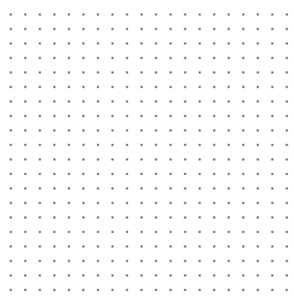
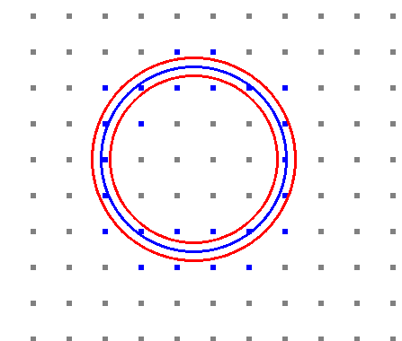
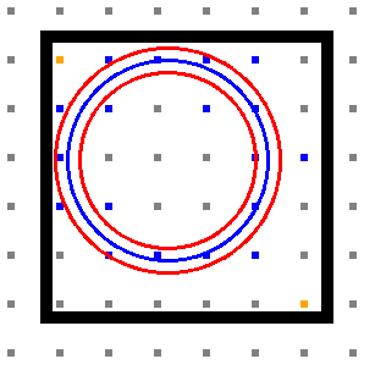
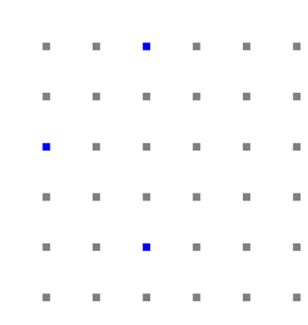
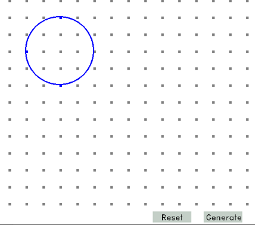

## Open CV Best Fit Circles

# Radius Drag Method:
Initially, the grid points are overlaid on the background which are 40 units apart but can be customizable by changing the grid size. When the program runs, an empty grid is displayed as followed. 

 

User can click anywhere on the grid and drag the mouse to anywhere else on the grid. Once the mouse click is released, there are three circles displayed.

 

The description of each circle and the highlighted points are as follows:
1.	Blue circle: The blue circle indicates the user generated circle where the user clicks to place the center and drags to set the radius. Once the mouse click is released, that will be the final radius length.

2.	Inner Red Circle: The inner red circle determines the smallest radius that can fit the blue highlighted points within a certain threshold. The threshold can be changed to configure the tightness of the circle

3.	Outer Red Circle: The outer red circle determines the smallest radius that can fit the blue highlighted points within a certain threshold. Like the inner red circle, the threshold can be changed

4.	Blue points: The points that are highlighted blue determine the best fit points to the circle that is generated by the blue circle within a certain threshold. 

### Algorithm breakdown:
1.	The grid coordinates are recorded when the user initially generates the circle which are passed to get_best_fit_distances function.

2.	Inside the function, the top left and the bottom right points that are closest to the exterior of the circle are calculated and points between this area are computed for best fit. These points are indicated in orange below and the black square determines the bounds to select the potential best fit points. 
 

 

 
3.	Euclidean distances are measured for each point to the center of the circle and if the distance is within a certain threshold of radius, that point is a best fit point. Each distance value is stored in a vector.

4.	Once the best fit points are computed, draw_threshold_circles function iteratively decreases the radius of inner circle and increases the radius of outer circle and checks to see the distances are still within threshold for all them.

5.	This occurs until at least one best fit point is not valid for both circles and the new threshold circles are drawn on the grid. 

## Toggle Points Method:
Like previous part, the program starts of by displaying an empty grid. In this scenario, the user can toggle points on the grid which will be marked blue after selection and click generate to plot a best fit circle. There should be atleast three points selected for the algorithm to start generating best circle. The best fit circle is approximated by using Polak and Ribière method where a circle center coordinates, and radius length are estimated using point triplets and are minimized iteratively until a best fit is found (MAISONOBE 3).

 

       

 

      

As shown in the image above, the user can select 3 or more points and click generate to form a best fit circle. 

### File Structure:
main.cpp 
Grid_Points.cpp 
Grid_Points.h 
Best_Fitting_Circle.cpp 
Best_Fitting_Circle.h: 

### Algorithm Breakdown:

1.	Inside main.cpp, the bulk of the execution occurs in mouse_activity which is a callback function for any recognizable mouse movements or clicks. Once the user selects at least three grid points and clicks generate, the points are then stored in a vector.

2.	An object of class Best_Fitting_Circle is then created with vector of selected points as constructor parameter. 

3.	The function compute_best_fit_circle which is part of Best_Fitting_Circle class determines whether the circle can be generated with the given points. 
Note: compute_best_fit_circle calls other functions that are part of the Best_Fitting_Circle to check to see if a circle can be generated by implementing the Polak and Ribière method. This method is discussed more in depth below.

4.	If there is a best fit circle, then the variables radius_estimate and circle_center_est are updated accordingly. There are getter methods for these variables are available in the class file. 

5.	If the circle is computable, then radius and circle center coordinates are retrieved from the getters and are plotted on the grid. 

6.	The functions named click_contains_reset and click_contains_generate_box check every mouse click to see if there is an overlap between the mouse click coordinates and the button’s coordinates. 

### Polak and Ribière Method:

In the compute_best_fit_circle, an initial estimate of circle center is returned by initial_estimate where the algorithm takes in each combination of point triplets and calculates the average center location between those points. An estimated radius is then calculated by averaging the distance between estimated center and selected points. This would generally give a decent guess for rough estimates for best fit circle parameters but usually have high error rate. To reduce the error, Polak and Ribière Method are further applied.

A least square estimator is then applied based on Euclidean distance to get a best fit for the given points (MAISONOBE 4). The cost is initially calculated in cost_function which is used to check if the estimated parameters are between certain epsilon thresholds which means the parameters are a good fit. If it’s not a good fit, then the converge method uses the directional gradients calculated in get_gradient_for_conjugate_gradient to iteratively reduce the radius and circle center estimates and updating cost. The error rate between the previous and current costs are checked every iteration to check to see if the rate is less than the epsilon threshold. If the cost cannot fall below the epsilon threshold within a given number of iterations, then the circle cannot be generated, and an error is displayed on output terminal.  However, if the error rate for cost falls below the threshold, then a circle is plotted on the graph using the updated parameters. 
To learn more in depth about Polak and Ribière Method, refer to this article:
http://www.spaceroots.org/documents/circle/circle-fitting.pdf

### Sources:
1.	MAISONOBE∗, L. “Finding the Circle That Best Fits a Set of Points.” Space Roots, 25 Oct. 2017.

